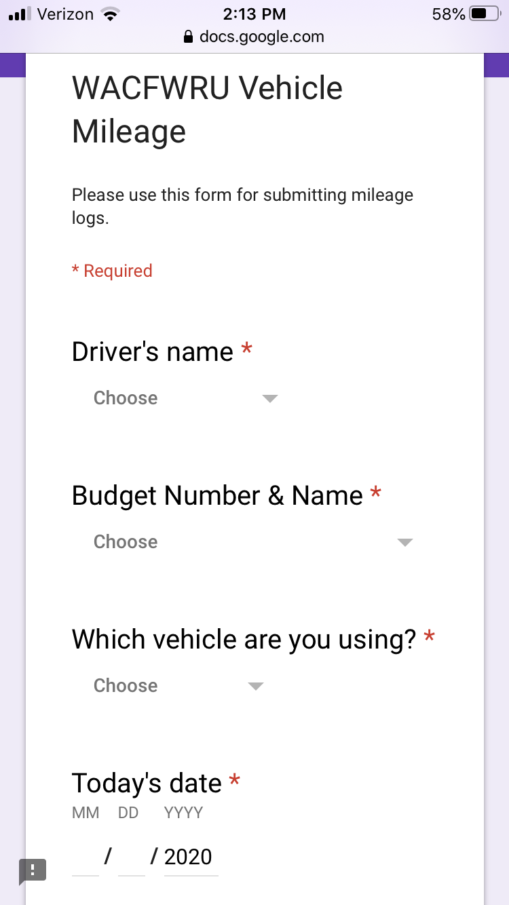
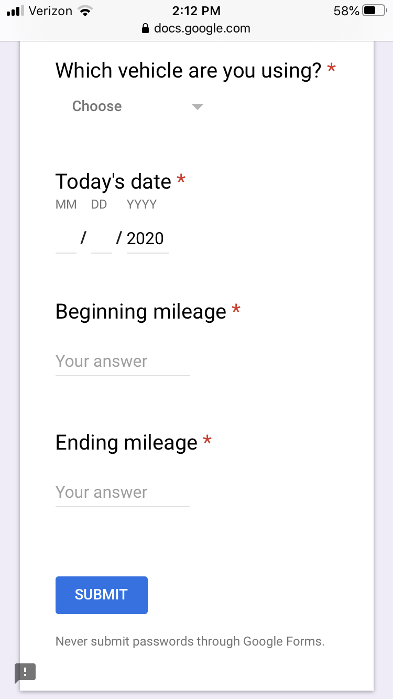
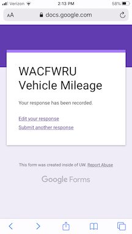

# WACFWRU Vehicle Procedures

Here are the instructions for using the Unit's vehicles and logging their mileage.

## Keys & clipboards

Each of the Units' vehicles as its own clipboard containing the keys to vehicle and a pen and copies of the old paper logs.

## Beginning a trip

We use an electronic form for entering the budget number to which the vehicle mileage should be charged and the beginning and ending mileage. Please follow these steps for entering the appropriate information **before you begin driving**..

1. Each vehicle clipboard has the following QR code, which contains a link to the electronic mileage log:

**iPhone users**: Open the camera app on your phone and point the camera at the QR code. The camera will automatically recognize the QR code and a banner will appear at the top of the screen that says

> WEBSITE QR CODE  
> Open "forms.gle" in Safari

**Android users**: Open the camera app on your phone and point the camera at the QR code. Hold the camera there for 2-3 seconds and see if the camera recognizes the QR code. If so, a popup window will appear asking if you want to open the link in Chrome

> Open URL  
> forms.gle  
>      CANCEL   OK

**If your phone's camera does not recognize the QR code, you will need to download a third party app to do so.**

2. Click on the banner, which will take you to the reporting form (if it's your first time visiting the form, you will be asked to log into the UW network with your netID and password.). Select one of the options from the dropdown menus for the following three fields:

* Driver's name

* Budget Number & Name

* Which vehicle are you using?

4. Enter the date and beginning mileage from the odometer, rounding any fractional tenths of a mile upward to the nearest integer (eg, enter "102.3" as "103"). At this point you can enter any value for the "Ending mileage", as you will have to edit this field once your trip is complete.

5. When you are done entering the above information, click the blue **SUBMIT** button. You should see the following completed form:

## Trip completion

Upon completion of your trip, click on the "Edit your response" link on the completed form from above. Enter the actual ending mileage, again rounding up any fractional miles to the next greater integer.

## Paper alternative

If you should encounter any problems with using the electronic mileage form, please complete one of the paper forms inside the clipboard. As soon as possible following your return, please give the paper record to Verna.

## Receipts

Place any receipts you have for gas, parking, ferries, etc inside the clipboard until you return to SAFS. As soon as possible following your return, please give any receipts to Verna, along with the appropriate budget information.

