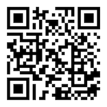

# WACFWRU Vehicle Procedures

Here are the instructions for using the Unit's vehicles and logging their mileage.

## Keys and clipboards

Each of the Units' vehicles as its own clipboard containing the keys to vehicle and a pen copies of the old paper logs.

## Logging mileage

We use an electronic form for entering the budget number to which the vehicle mileage should be charged and the beginning and ending mileage. Please follow these steps for entering the appropriate information.

1. Each vehicle clipboard has the following QR code, which contains a link to the electronic mileage log:

**iPhone users**: Open the camera app on your phone and point the camera at the QR code. The camera will automatically recognize the QR code and a banner will appear at the top of the screen that says

> WEBSITE QR CODE  
> Open "forms.gle" in Safari

2. Click on the banner, which will take you to the reporting form. (If it's your first time visiting the form, you will be asked to log into the UW network with your netID and password.)

## Receipts
